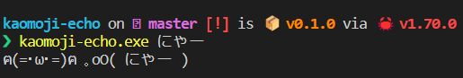

# ฅ(=･ω･=)ฅ ｡oO( kaomoji-echo )



`echo`コマンドに顔文字をつけるネタコマンドです。
エイリアスを設定することでechoがかわいくなります。

## 使用方法

```sh
kaomoji-echo --help
Usage: kaomoji-echo [OPTIONS] [STRINGS]...

Arguments:
  [STRINGS]...

Options:
  -n, --newline
  -e, --escape
  -h, --help     Print help
  -V, --version  Print version
```

## 設定

`config`ファイルである`kaomoji-config.toml`は以下のディレクトリに保存されます

|Platform | Value                                 | Example                                  |
| ------- | ------------------------------------- | ---------------------------------------- |
| Linux   | `$XDG_CONFIG_HOME` or `$HOME`/.config | /home/alice/.config                      |
| macOS   | `$HOME`/Library/Application Support   | /Users/Alice/Library/Application Support |
| Windows | `{FOLDERID_RoamingAppData}`           | C:\Users\Alice\AppData\Roaming           |

デフォルトのコンフィグは以下のものになっています。
`default`及び`presets`を設定することでカスタマイズできます。
```toml
default = "neko"

[[presets]]
name = "neko"
kaomoji = "ฅ(=･ω･=)ฅ "
speech_bubble_left = "｡oO("
speech_bubble_right = ")"

[[presets]]
name = "happy"
kaomoji = "( ＾ω＾) "
speech_bubble_left = "< "
```

## インストール方法

```sh
cargo install --git https://github.com/Namacha411/kaomoji-echo
```

## アンインストール方法

```sh
cargo uninstall kaomoji-echo
```
